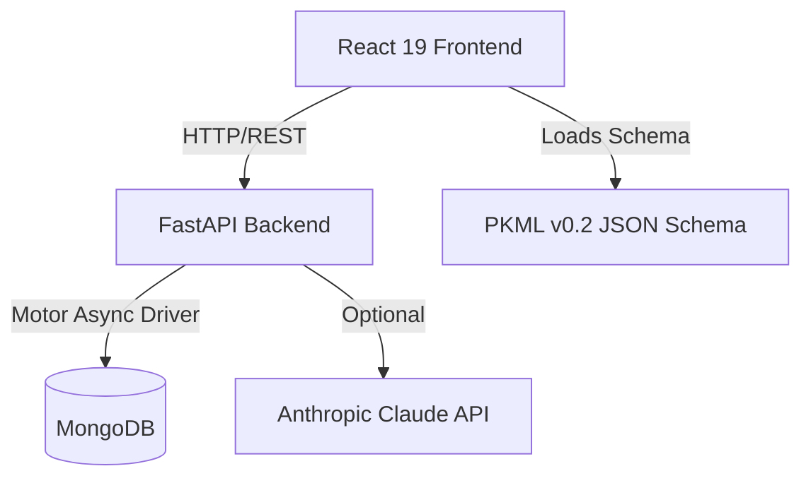

# PKML System Architecture

PKML operates as a full-stack web platform designed to create, validate, and share structured product knowledge.

## High-Level Topology

## Component Breakdown. 
1. Frontend (/frontend)
   Framework: React 19 with Tailwind CSS and shadcn/ui components.
   Editor: Monaco Editor for live JSON validation and completeness scoring.
   State Management: Shared state for pkmlContent and activeDocId across Editor, Builder, and View pages.
   2. Backend (/backend)
      Framework: FastAPI (Python 3.11) with Uvicorn.
      Database: MongoDB via the motor async driver.
      Responsibilities: v0.2 schema validation and completeness scoring.
      Persistence (Save, Publish, Unpublish, Star).
      AI-powered README parsing (fallback to regex if ANTHROPIC_API_KEY is absent).
      Markdown export generation.
      Deployment ModelThe system is containerized via Docker.
      The docker-compose.yml orchestrates:mongo: Persistent MongoDB 7 instance.
      backend: FastAPI server exposing port 8000.
      frontend: Nginx serving the compiled React static assets on port 3000.

      
